{fig-align="center" width="1.6in" height="1.9in"}

August 26, 2026

# Overview

The "lit-tag" project is a set of two R Shiny modules ("lit-tag-builder" and "lit-tag-viewer") that are used to create and display a database that adds tags to the output of a Zotero library (Figure 1). The apps are generic with regard to subject matter - the user picks the Zotero library and defines the tag and notes fields. This guide describes the lit-tag-builder module used by database builders to add tags to each of the papers in an exported Zotero file.

## The lit-tag database

The lit-tag database is a .csv file created in lit-tag-builder that contains citation information exported from Zotero and user generated tags and notes associated with each citation. Each row in the lit-tag database has information on one citation that was exported from Zotero. The lit-tag-builder downloads the lit-tag database to the local drive, where it can then be reloaded in lit-tag-builder for editing or read by lit-tag-viewer for generating graphs, summary tables and reports.

## Zotero export file

The project starts with the creation of a Zotero library on the subject of interest. The Zotero library (or collection within the library) is then exported as a .csv file. (Figure 1). The zotero file only needs to be generated when creating a new lit-tag db or periodically when you want to add new papers to the lit-tag db from the zotero library. The lit-tags apps do not directly interact with the Zotero app; all interaction occurs indirectly through files exported from Zotero or imported to Zotero.

|  |
|:-----------------------------------------------------------------------|
| 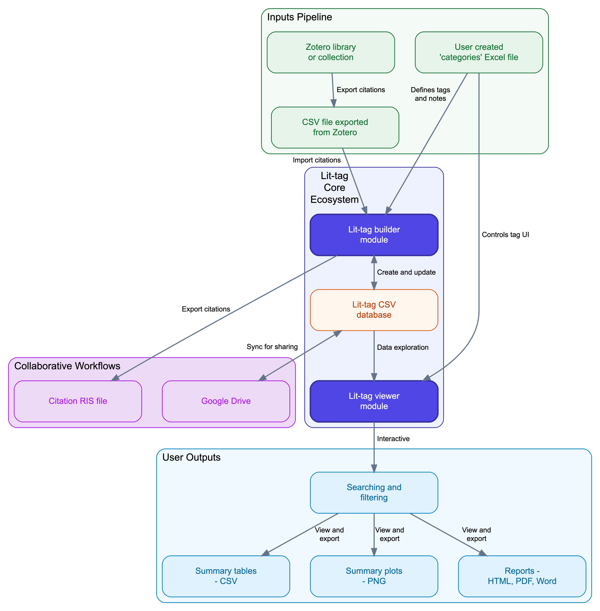{width="7.37in" height="7.5in"} |
| Figure 1: Relationship between Zotero, lit-tag-builder module, lit-tag-viewer module and imported/exported files. The lit-tag database is stored as a .csv file on a local computer, so it is not designed for simultaneous edits by multiple users. Sequential editing by multiple users can be accomplished by sharing the database on a platform such as Google Drive. |

## Interface Overview

The lit-tag-builder has six main tabs: "Tag edit", "New database", "Sync Zotero" "Database Maintenance", "New Zotero" and "Help" (Figure 2).

|  |
|:-----------------------------------------------------------------------|
| 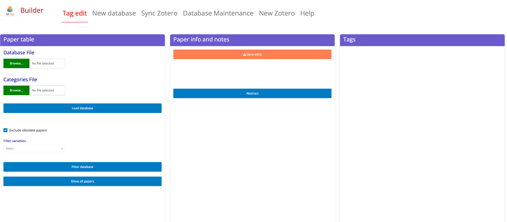{width="6.354166666666667in" height="2.7916666666666665in"} |
| Figure 2: Screen shot of opening user interface |

## Help

The "Help" tab has options to display and download this user guide (Figure 3) and downloading two example datasets: 1) Unicorn example and 2) mCDR example (Figure 4). The example files are .zip files containing .csv and excel files. The unicorn example started with a search of Google Scholar using the search term "unicorn". Most of the first 41 papers (excluding those without a publication year) were imported into a Zotero library using the Zotero connector browser extension. Those references and the generated example files are highlighted in this user guild. The unicorn paper collection and annotation in lit-tag-builder serve no conceivable academic purpose - they are just to demonstrate how lit-tag-builder works. The mCDR example, on the other hand, is based on partial results from tagging papers related to the interaction of marine carbon dioxide removal (mCDR) and fisheries (Grabb et al. in prep.)

|  |
|:-----------------------------------------------------------------------|
| 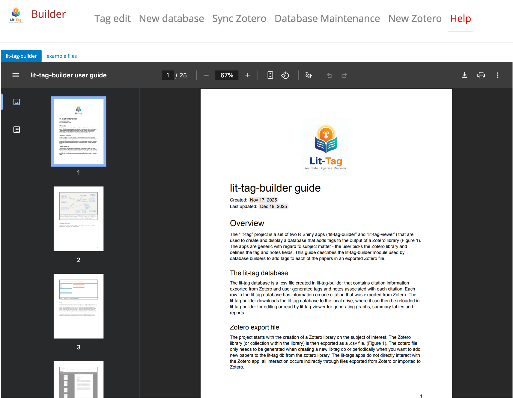{width="6.354166666666667in" height="4.930555555555555in"} |
| Figure 3: Help tab showing user guide. |

|  |
|:-----------------------------------------------------------------------|
| 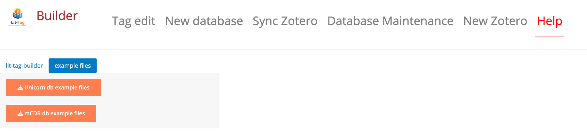{width="6.354166666666667in" height="1.4861111111111112in"} |
| Figure 4: Help tab showing example file download. |

# Making a new lit-tag-database

This section describes making a new lit-tag database from an existing Zotero library or collection. The section below titled "New zotero", describes the reverse process of creating a new zotero library from an existing lit-tag database . Creating a new database is done on the "New database" tab (Figure 5). Making a lit-tag database requires two input file types: 1) A Zotero .csv export file and 2) a "Categories" excel file.

|  |
|:-----------------------------------------------------------------------|
| 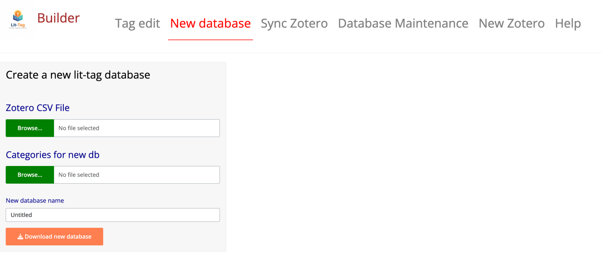{width="6.354166666666667in" height="2.7083333333333335in"} |
| Figure 5: New database tab. |

### Zotero export

The Zotero .csv export file is created in the Zotero desktop app by right clicking on the collection (or entire library) and selecting "Export collection..." then selection format "CSV" (Figure 6). In the Unicorn Example download the zotero export file is named "unicorn_zotero.csv". There is no zotero download file example in the mcdr example download.

|  |
|:-----------------------------------------------------------------------|
| 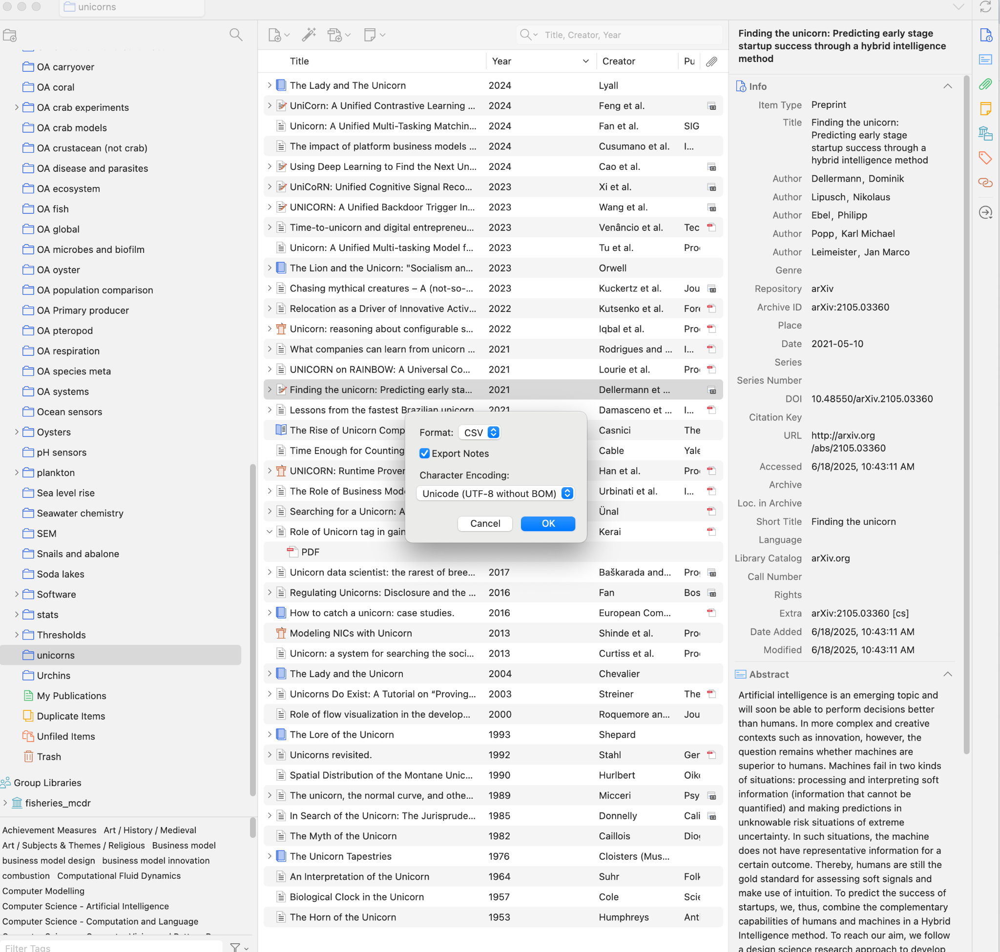{width="6.354166666666667in" height="6.055555555555555in"} |
| Figure 6: Screen shot of exporting .csv file from Zotero. |

### Categories File

The categories file is a user-created excel file that defines the tag variables, the tag value options and the category structure for tags. In the file, each tab defines a general category for grouping tags in the app user interface. There is no limit to the number of categories (tabs) and the names of the categories are up to the user. There must be one tab named "notes" (more on this below).

Within the category tabs, each column provides information on one tag. The first row is the name of the tag and the second row is the type of input used in the interface of the lit-tag-builder app. Options for the type of input on the second row are: "check_box_single", "check_box_multiple", "text_box" or "date". The rows below the type of input are the potential tag value options that will be selected by the user. There is no limit to the number of tags (columns) on each category tab and there is no limit to the number of tag value options (rows) for each tag. The tags can be named whatever is informative and in a format (e.g. spaces) that will look nice in the user interface.

In the current version of lit-tag, tag options must be entered in snake_case format. The snake_case format is all lower case letters, with words separated by underscore ("\_"). Numbers can be used, though not as the first character, and no special characters are allowed. In future versions of lit-tag, we plan to remove the snake_case restriction. The options list for a tag will be displayed in the lit-tag-builder and lit-tag-viewer interfaces in alphabetical order, regardless of the order in which they appear in the Categories file. The exception is a tag option of "not_applicable", which will always appear at the end of the alphabetized list. The "not_applicable" option also has special features in lit-tag-viewer, for example, it is easy to filter "not_applicable" tag options from summary graphs.

The "notes" tab lists the notes fields that will be associated with each of the papers. The notes fields have a different type of user interface that can allow for the input of a lot of text and the notes are located in a different part of the user interface from the tags. The "notes" tab has only one column of data. The first row has the label "Notes" the second row specifies the type "text_area". The rows below the input type ("text_area") specify the names of notes fields. There is no limit to the number of notes fields that can be included.

The categories file can be changed even after you have been working with a database and tagging files. This might happen if you decide to add more categories, tags or tag value options. However, it can be challenging to maintain a consistently tagged database if you change the categories file often or dramatically. It is best to get this right (or at least very close) before you start tagging.

In the unicorn example download, the categories file is named "unicorn_categories.xlsx" and in the mcdr example download, the categories file is named "mCDRxFisheries_TagCategories_20251210.xlsx".

## Steps for creating a new lit tag database

Note that this only needs to be done once! After creating the initial database, you only need to deal with zotero export files if you want to add more papers to the lit-tag database or fix typos or omissions in the zotero library (more on fixing zotero errors below).

1.  On the "New database" tab, browse to the exported Zotero .csv file for the "Zotero CSV file" to the categories excel file for the "Categories file for new db".

2.  Enter a name for the new database file

3.  Click the "Download new database" button. This will display information about how many papers were added to the lit-tag database. The new lit-tag database is then automatically downloaded to the user's default download location (usually the "Downloads" folder). (Figure 7)

|  |
|:-----------------------------------------------------------------------|
| 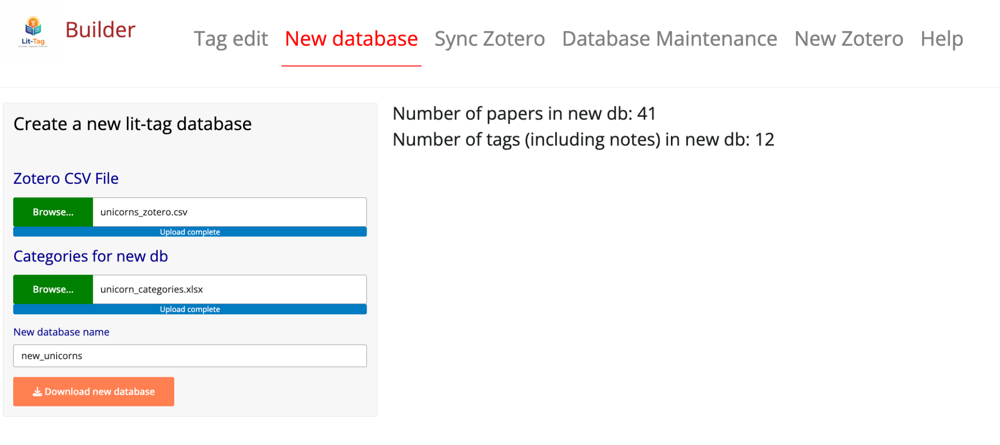{width="6.354166666666667in" height="2.8333333333333335in"} |
| Figure 7: Screen shot of result from creating a new lit-tag unicorns database called "new_unicorns" (the full name of the file in the downloads folder is "new_unicorns.csv" |

### More on the lit-tag Database

The lit-tag database is a .csv file with a header row with the names of the fields imported from zotero, the tags and note fields from the categories file, plus a few housekeeping fields added by the lit-tag-builder app. Below the header there is one row for each paper. In general, avoid directly manipulating this file. It is best to use the lit-tag builder app to make changes or you may break the file so that it will not work properly in lit-tag-builder or lit-tag-viewer. However, this is just a plain .csv file and can be imported for analysis (e.g to make publication quality graphs). The lit-tag-viewer app uses the lit-tag database (or a copy) as the input for making pretty graphs, summary tables and filtered data sets and reports based on the zotero and tag fields. Although only a subset of the Zotero exported fields are displayed in lit-tag-builder or lit-tag-viewer, the database retains all the original zotero export fields, which could be used for external analysis.

### Duplicating papers

Lit-tag is designed to associate one set of tags and notes with each paper citation exported from Zotero. However, there are situations where having multiple unique sets of tags associated with one paper is useful. For example, a biology paper may describe the experiments on two species and the analysis is needed at the species level, not at the paper level. As a workaround to achieve this functionality, papers can be duplicated in Zotero and each duplicate will show up as a separate in the lit-tag database created from the Zotero file. To keep track of which Zotero entry is associated with set of tags (e.g. which species), data can be entered in the Zotero "extra" field (Figure 8). The extra field is a Zotero data column intended to contain optional extra citation information about a reference (e.g. publisher details). With lit-tag, we re-purpose this column to contain the information distinguishing duplicate citations. In this example, species information is added to the extra field. Duplicating citations in Zotero is not an ideal practice, but this approach provides a workable option until a solution duplicating citations inside lit-tag can be developed.

|  |
|:-----------------------------------------------------------------------|
| 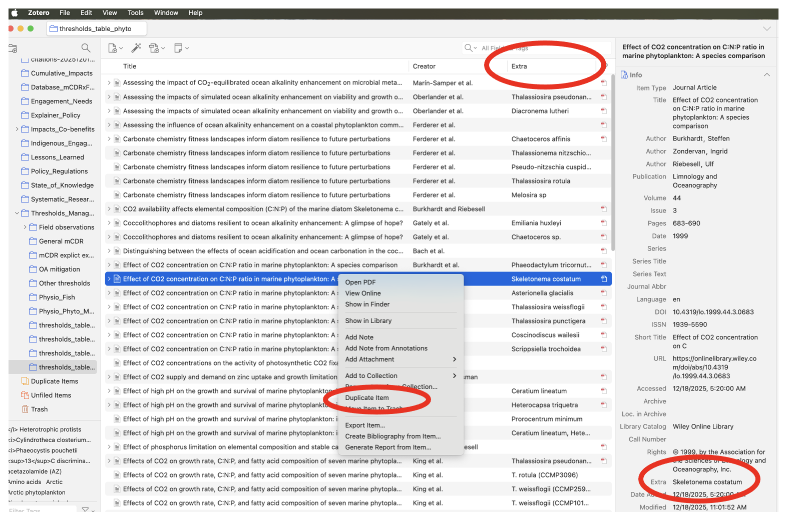{width="6.354166666666667in" height="4.208333333333333in"} |
| Figure 8: Zotero screen shot showing the "extra" column in the table window, the location of the extra field in the editing window and the menu to duplicate a citation. The screen shot example is for a library that duplicates papers so that there is one row per species. |

# Tag Editing

### Load database and categories

The database and categories files must be loaded before starting to tag. On the "Tag edit" tab, browse to the lit-tag database .csv file and the categories excel file. Then click the "Load database" button (Figure 9).

|  |
|:-----------------------------------------------------------------------|
| 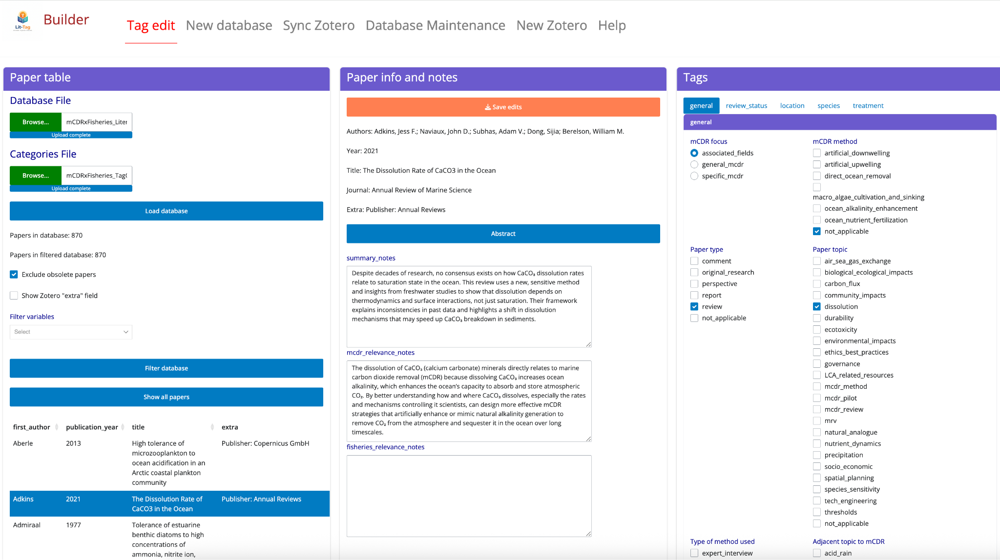{width="6.354166666666667in" height="3.5555555555555554in"} |
| Figure 9: Tag Editing window example from the mCDR database. |

### Tagging window

The tag editing tab is divided into three panels. The left panel primarily contains a table with basic info on the papers in the database that is used to select a paper for tag editing, the center panel includes a bit more information about the paper selected and fields to enter notes, and the right panel has radio buttons, check boxes and text entry fields for tagging a particular paper.

The left panel has input fields for the database and category files. The categories file will define which tags and notes are displayed in the center and right panels. If the categories file has been modified since the initial database was created, old tags may be present in the database but only displayed if they are included in the categories file. Pressing the "Load database" button populates the database table, notes and tags of the ui. After updating a database using the "Update database from Zotero" button on the "Sync Zotero" tab, you should run "Load database" to bring the new papers into the display. The left panel also displays the total number of papers in the database and the number of papers shown in the table after filtering (more on filtering below). Clicking on a row of the papers table selects that paper for tag editing. The left panel also includes options to "Exclude obsolete papers" and "Show Zotero "extra" field". Obsolete papers are described in the "Sync Zotero" section of this document. The "Show Zotero "extra" field" will display the extra field for projects that duplicate papers (see "Duplicating papers" section of this document).

In the center panel the "Save edits" button saves any tag edits to the database. All changes to tag edits on all papers are instantly saved in working memory, but the changes are not saved to the database file until you press the "Save edits" button. This is important. Pressing the "Save edits" button downloads the edited database to the Downloads folder. The downloaded file will have the same name as the originally loaded .csv database file, but with the date and time (UTC) appended. The appended date has the format "year_month_day_time_timezone". The time stamps are always in UTC to aid in collaboration of multiple people working on tagging for the same project in different time zones (more on collaboration workflows below). Downloading with every save can generate a lot of files in your download file if you save often (which you should). When opening a file for tagging next time, make sure you use the file with the most recent time stamp. The center panel also includes a little more detail about the selected paper (complete author list, year, title, journal) and a button to pop up the paper abstract. The rest of the center panel contains fields to enter the reviewer notes about the paper.

The right panel is the place to view and edit tags for a paper. Each of the tabs is a tag category (as defined by the tabs of the categories file). Selecting a tab displays the list of options for all of the tags in that category. This panel is a lot of fun if you like check boxes.

## Filtering

In editing the papers, it is helpful to filter the paper table. For example, it might be helpful to only look at high priority, non-obsolete papers that have not yet been reviewed. It is possible to filter on any field in the database (i.e. zotero, tags, notes and db timestamp fields). The fields to use for filtering are selected in the "Filter variables" dropdown menu (Figure 10). Once the variables for filtering are selected, check boxes of the values in the database for those variables are displayed below the "Filter variables" dropdown input. After checking the values that you want to include in the filtered dataset, click the "Filter database" button. The filtered database then appears below the filter selection button and can be used to pick papers for tagging. To remove the filtering, click the "Show all papers" button.

|  |
|:-----------------------------------------------------------------------|
| 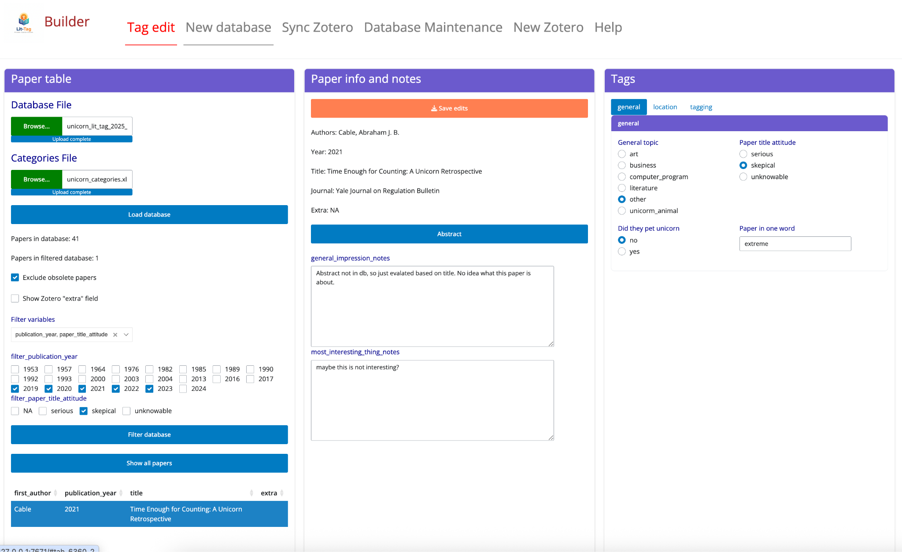{width="6.354166666666667in" height="3.888888888888889in"} |
| Figure 10: Example filtering the unicorn database. |

# Updating the categories file

The categories file will be used to create tag fields for the new papers that are added to the LitTag database. The categories file will generally be the same one used for the original database creation and previous updates. However, the categories file could be a modification of the previous categories files with added or removed tags. The new database will include all the tags that were added originally and in previous updates plus any new tags in the new modified categories files. To prevent loss of previously entered tag information, tag fields are never removed from the database unless through using the "Database Maintenance" tools.

# Syncing with Zotero

It is important to note that the lit-tag-builder app does not directly interact with the Zotero app in any way. The lit-tag-builder app uses as input static files exported from Zotero, therefore updating the papers in the lit-tag database is done at discrete intervals whenever the user decides it would be useful.

The lit-tag-builder app uses the "keys" field generated by Zotero as the mechanism to sync exported zotero libraries or collections and the associated lit-tag database. When a document reference is added to a Zotero library, zotero creates a unique internal key (string of letters and numbers) for that entry. Two different zotero libraries will have two different keys for the exact same paper. Therefore, it is essential that when updating a lit-tag database with an updated exported zotero library that you are using the same Zotero library that was used to initially create the lit-tag database. If multiple people are working on the same lit-tag project, a Zotero group library is a great option for managing the Zotero side of things.

To sync with an updated Zotero file, browse to the database and categories file for syncing and the new Zotero download file on the "Sync Zotero" tab. Then click the "Update database from Zotero" button. This will save a new version of the database with a new time stamp that includes the new references from Zotero and updated Zotero data (e.g. corrected typos in Zotero) for existing papers.

After pressing the "Update database" button, the app will add any papers from the zotero file that are not already in the database (based on comparing keys). The tags for the newly added papers will all be missing (i.e. no option selected and notes fields are blank). The app displays how many papers were in the database before the update, the numbers of papers in the zotero export file, and the number of new papers added to the database. There can also be papers that are in the original database that have no matching keys in the zotero database. This can occur when papers are deleted from the zotero library after they have already been added to the lit-tag database. To avoid losing any data, these "obsolete" papers are not deleted from the database (however, they can be filtered out). The database field "date_time_added_db" contains a timestamp of the date that a paper was added to the database. The database field "date_time_obsolete_db" contains a time stamp of the date that a paper was flagged as obsolete (no longer in the zotero library) during a sync operation. The obsolete papers can be excluded from tagging operations by selecting the "Exclude obsolete papers" checkbox on the "Tag Edits" tab.

|  |
|:-----------------------------------------------------------------------|
| 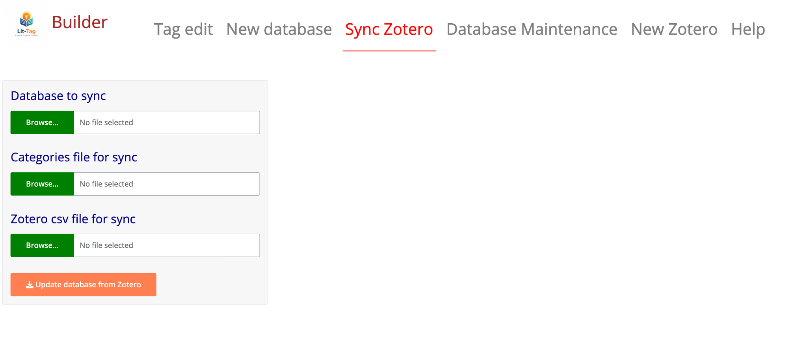{width="6.354166666666667in" height="2.7916666666666665in"} |
| Figure 11: The Sync Zotero tab. |

# Database Maintenance

The Database Maintenance tab provides options for looking at the contents and "cleaning up" the lit-tag base. The Database Maintenance tab has three sub-tabs: 1) Database contents, 2) Compare databases, and 3) Replace/delete data (figure 12).

## Database contents

The shows the names of all the tag field and the number of unique values in the actual database (Figure 13). By clicking on the name of a tag in the data, the unique values in the database can be displayed (Figure 14). It is important to understand the distinction between the categories file and the database. The categories file is used to create the user interface for the tag editing in lit-tag-builder and for display and filter options in lit-tag-viewer. The user can change the categories file over time, for example, if it is decided that one of the tags is not very informative and can be eliminated. However, if the tag was used for previous versions of the database, the old values are part of the database and will show up when viewing the database contents. These, old, unused values could be targets for deletion (as described in a later section).

|  |
|:-----------------------------------------------------------------------|
| 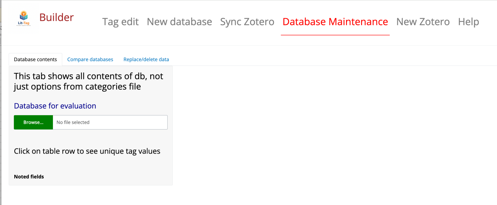{width="6.354166666666667in" height="2.625in"} |
| Figure 12: Database Maintenance tab. |

|  |
|:-----------------------------------------------------------------------|
| 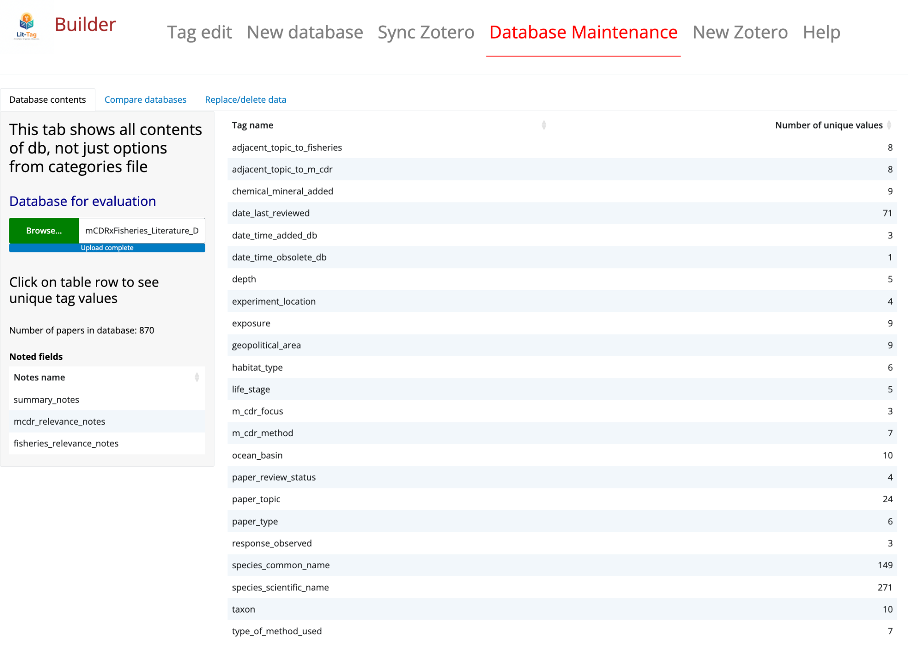{width="6.354166666666667in" height="4.569444444444445in"} |
| Figure 13: Example database contents |

|  |
|:-----------------------------------------------------------------------|
| 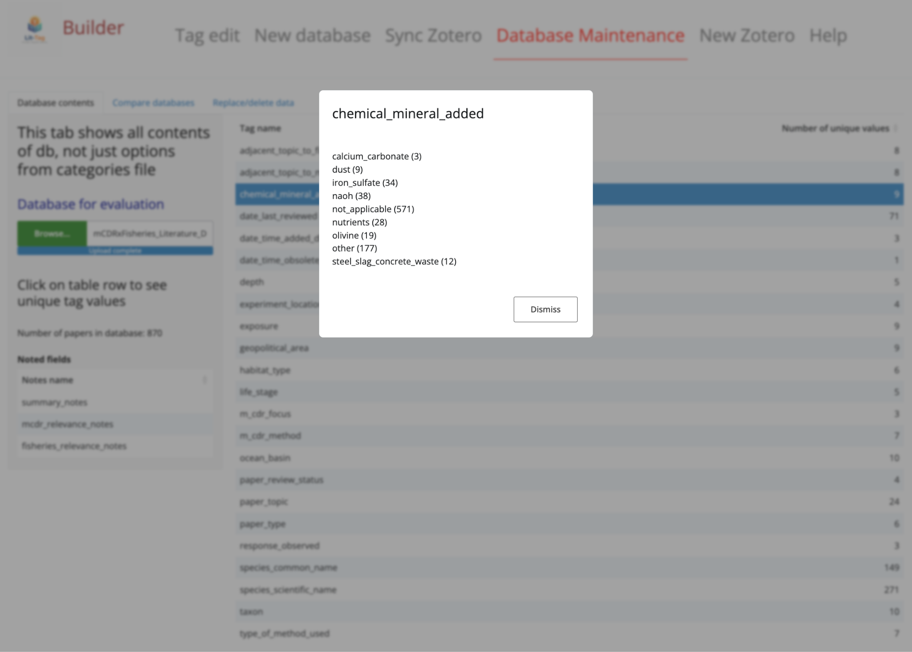{width="6.354166666666667in" height="4.541666666666667in"} |
| Figure 14: Example display of unique values in the database for a particular field (in this case, the "chemical_mineral_added" field. |

## Compare databases

The Compare databases tab is used to find papers that are in one database but not in another (based on comparing zotero key values)(Figure 15). This is useful for a before/after comparison of database after a "Sync zotero" operation or after deleting papers based on tag criteria (described below).

|  |
|:-----------------------------------------------------------------------|
| 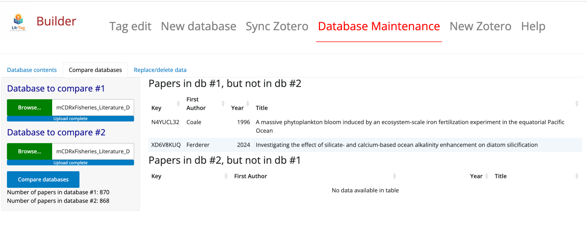{width="6.354166666666667in" height="2.4722222222222223in"} |
| Figure 15: Example compare database. |

## Replace/delete data

The Replace/delete data tab is used to alter the contents of the database. It is useful for cleaning operations for tasks such as fixing typos in tag and tag option names or deleting unused tags. Downloading a change from a replace/delete action, results in the creation of a new database with the same name as the original but with an appended current timestamp.

### Replace tag name

Replaces the old tag name with the new tag name (Figure 16). This is a global replacement in the database. A version of the categories file should be used in the future that uses the new tag name. Note that the tag name in maintenance operations is converted to snake_case.

|  |
|:-----------------------------------------------------------------------|
| 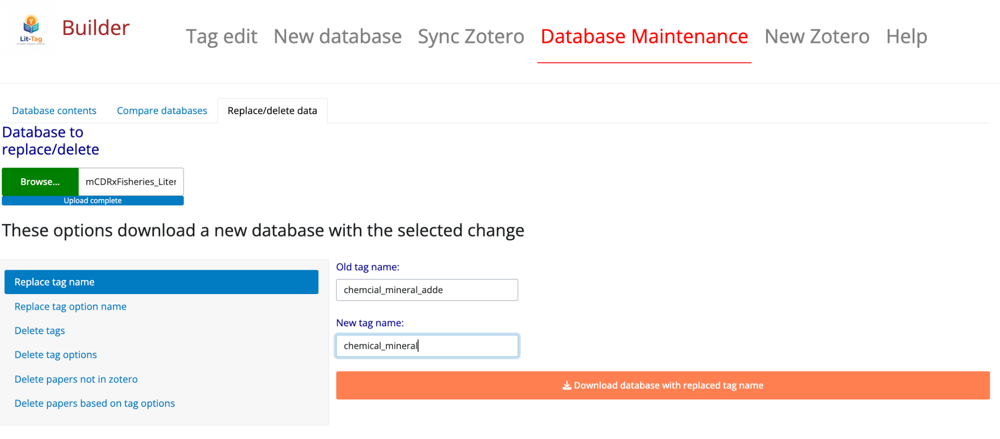{width="6.354166666666667in" height="2.7916666666666665in"} |
| Figure 16: Screen shot of Replace/delete data screen. |

### 

### 

### Replace tag option name

Replaces the old tag option name with the new tag name (Figure 17). This is a global replacement in the database. A version of the categories file should be used in the future that uses the new tag option name. Note that the tag name in maintenance operations is converted to snake_case.

|  |
|:-----------------------------------------------------------------------|
| 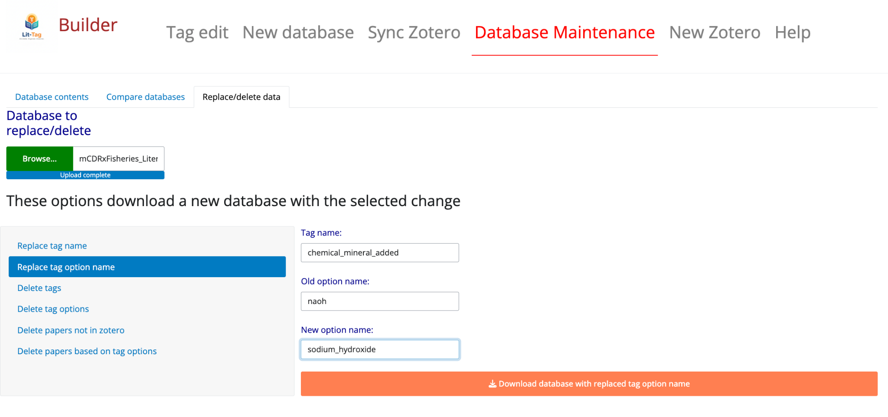{width="6.354166666666667in" height="2.986111111111111in"} |
| Figure 17: Example replace tag option name |

### Delete tags

Specify tags that are to be deleted because they are no longer used (Figure 18). The tags are specified as a comma separated list. Note that the tag name in maintenance operations is converted to snake_case.

|  |
|:-----------------------------------------------------------------------|
| 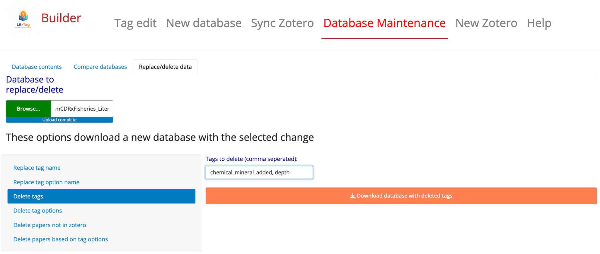{width="6.354166666666667in" height="2.6944444444444446in"} |
| Figure 18: Screenshot of tag deletion. |

### 

### 

### Delete tag options

Delete tag option from database because they are no longer needed. The tag options are specified as "tag/option" and multiple options with a comma separated list. For example,

"depth/med_depth, life_stage/egg" would delete both the mid_depth option from the depth tag and the egg option from the life_stage field. Note that the tag name in maintenance operations is converted to snake_case.

|  |
|:-----------------------------------------------------------------------|
| 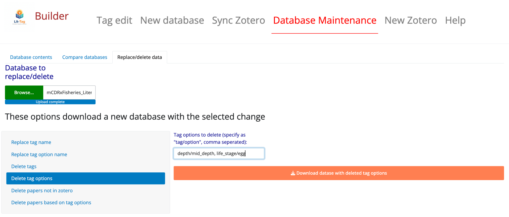{width="6.354166666666667in" height="2.7222222222222223in"} |
| Figure 19: Screenshot of delete tag options. |

### 

### 

### Delete papers not in Zotero

This is a way to permanently delete obsolete papers from the database.

|  |
|:-----------------------------------------------------------------------|
| 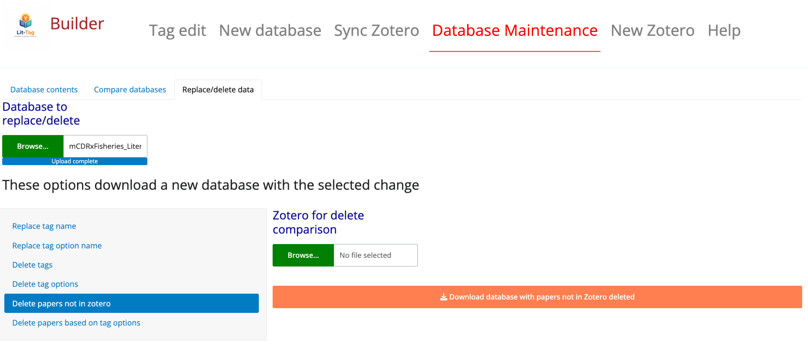{width="6.354166666666667in" height="2.7083333333333335in"} |
| Figure 20: Screenshot of delete papers not in zotero. |

### 

### 

### Delete papers based on tag options

This can be useful for elementing papers that are out of scope of your database or make a new, filtered database with a subset of the original data. It is probably good practice to include an "out_of_scope" option in your tag list to make it easy to remove unwanted papers. The tag options to delete are specified as "tag/option" and multiple options with a comma separated list. Note that the tag name in maintenance operations is converted to snake_case.

|  |
|:-----------------------------------------------------------------------|
| 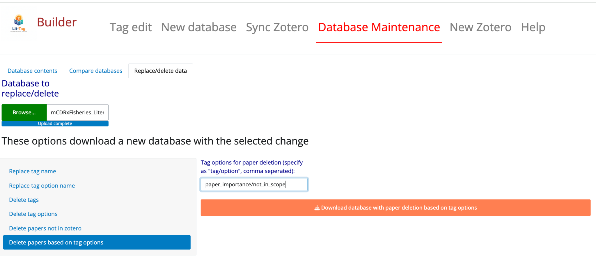{width="6.354166666666667in" height="2.9027777777777777in"} |
| Figure 21: Screen shot of delete papers based on tag options. |

# New Zotero

The New Zotero tab provides the ability to make a new zotero library linked (via matching keys) to a copy of an existing lit-tag database (Figure 22). The new zotero library and its associated new lit-tag database can then diverge independently from the original zotero library and database.

|  |
|:-----------------------------------------------------------------------|
| 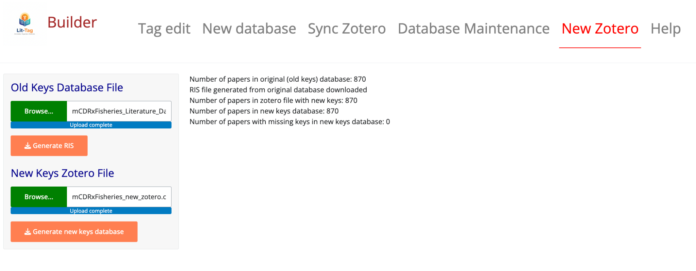{width="6.354166666666667in" height="2.486111111111111in"} |
| Figure 22: Screenshot of new zotero. |

## Steps for new Zotero

1.  **Create an RIS file from the original lit-tag database.** An RIS ([Research Information Systems) file is a standardized citation file format that can be imported into Zotero. The "Generate RIS" button on the New Zotero tab will extract the citation information from the "old keys" lit-tag database and make a file in RIS format. The citation information includes data like title, publication year, authors, journal, abstract, etc. It does not include tags or notes created in lit-tag. The generated file will be downloaded to the default downloads folder have the same name as the original old keys lit-tag database, but with a ".ris" extension.]{.mark}

2.  [**Import the RIS file into Zotero.** Import either into a new collection in your library or into a shared Zotero library. When the citations are imported, Zotero will generate new key associated the references. These keys will not match the "old keys" database file. After RIS generation, the information panel in the New Zotero tab will display the number of papers converted to RIS format from the old keys database.]{.mark}

3.  [**Export zotero collection as CSV file.** In Zotero, export the collection to a csv file. Do not make make any changes to the zotero collection between importing the RIS file and exporting the csv file.]{.mark}

4.  [**On the New Zotero tab, select the exported Zotero CSV file.** Use the Browse button to select this file.]{.mark}

5.  [**Generate a new keys lit-tag database.** The Generate new keys database button, takes the original "old keys" database and replaces the keys with the new keys from the new zotero collection. The key replacement is done by matching the publication year, author list and title from the exported Zotero csv file and the original old keys database. The generated new keys lit-tag database is placed in the default downloads folder and has the same name as the zotero CSV file, but with a current time stamp appended.]{.mark}

6.  [**Use the new Zotero library and new tags database.** The functionality of the Sync Zotero tab can now be used to modify the new lit-tag database to incorporate changes in the new Zotero library collection.]{.mark}

## Caveats for New Zotero

-   The new zotero file will only contain citation information (including abstracts). It will not contain any linked pdf files. With the current workflow, pdf files would need to be imported manually into the new Zotero collection for each paper.

-   The RIS format does not map perfectly to Zotero field options. For example, the RIS format does not support the item_type "preprint" so papers are coded as "UNPB" (unpublished). Most fields have a direct match, but there is occasionally a loss of information in the RIS format conversion.

-   Lit-tag-builder has no built-in functionality to merge two different, but related, zotero libraries with associated lit-tag libraries that have different keys. There may occasionally be workflows in which the ability to merge could be useful (for example, if a new library is created from an existing lit-tag database and it is developed independently to diverge from the original, then someone wants to combine the two libraries.). A merge would be possible, but it would require creation of a new, merged zotero library and custom coding to combine the lit-tag files and link all the keys. For now, it is probably a good idea to avoid workflows that require merging.