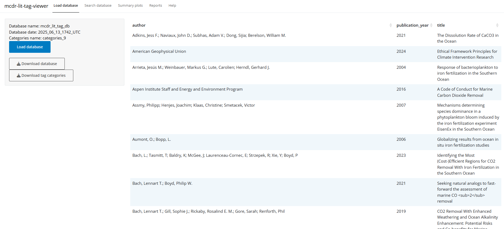
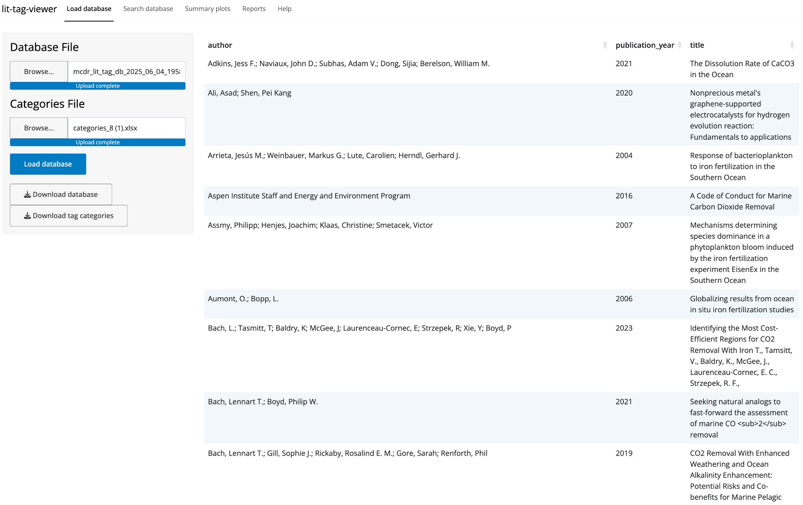
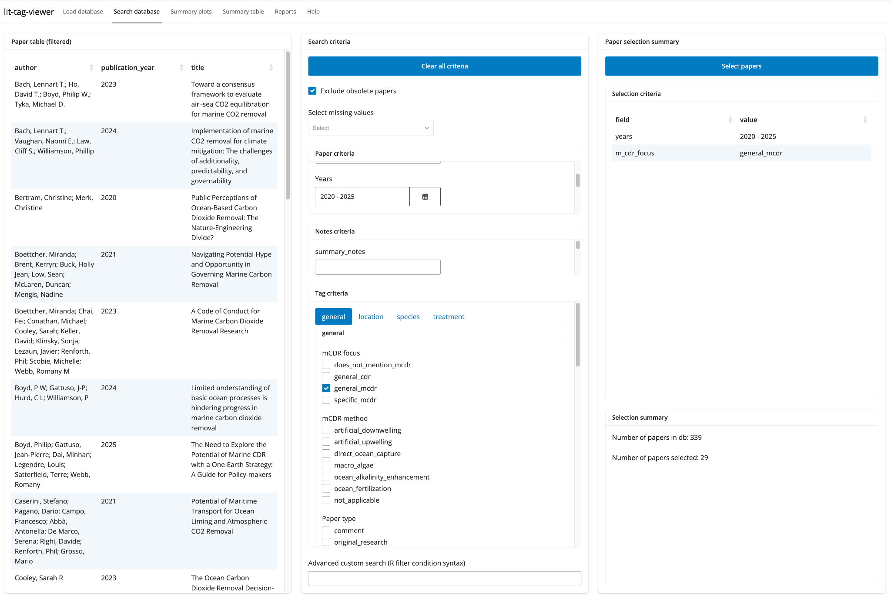
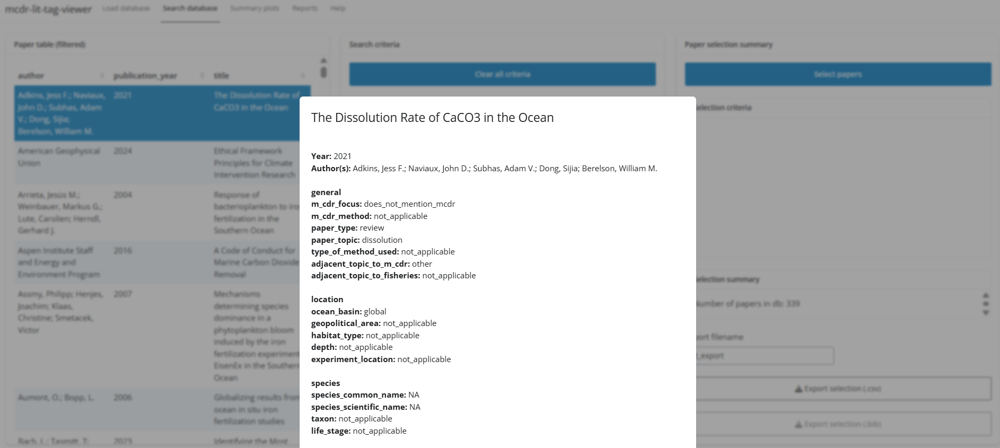
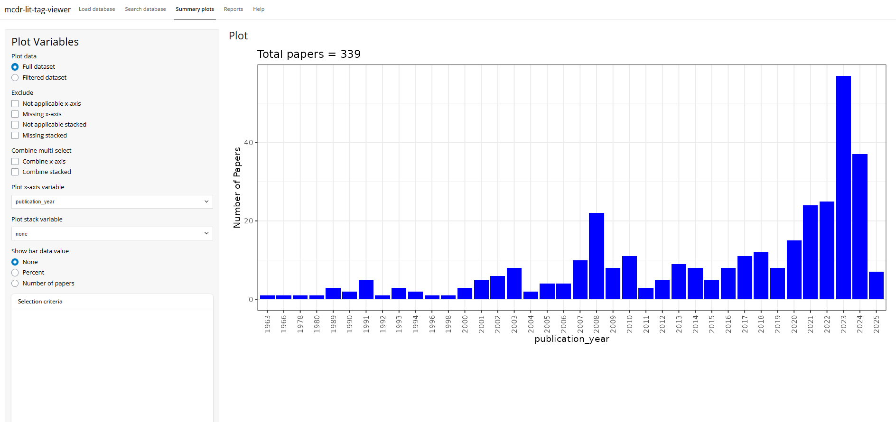
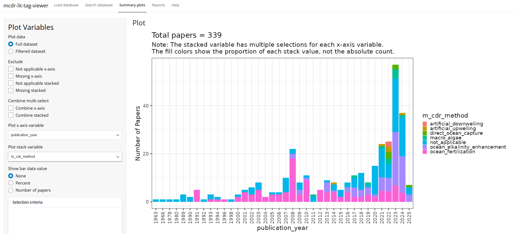
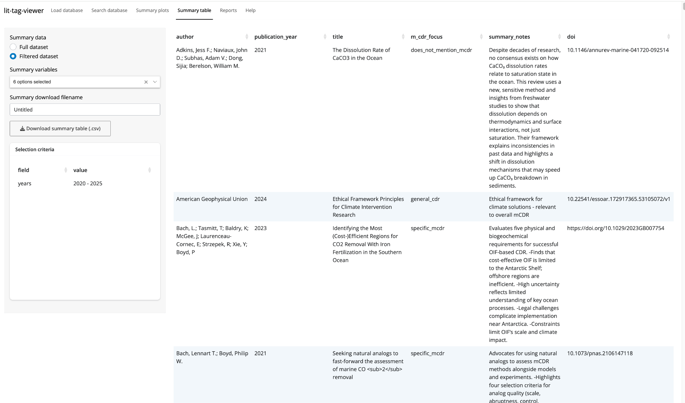
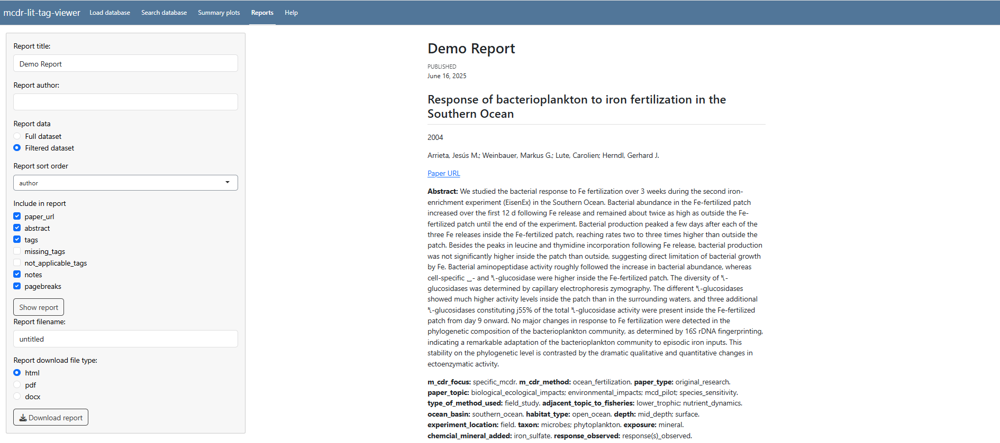

Created: June 6, 2025

Last Updated: June 16, 2025

# What is lit-tag-viewer?

The [[lit-tag-viewer
app]{.underline}](https://connect.fisheries.noaa.gov/lit-tag-viewer/)
allows users to search, visualize, and summarize a tagged literature
database created using the lit-tag-builder app ("lit-tag database").

The **[[Search database]{.underline}](#search-database)** feature
enables filtering based on paper criteria (*author, publication year,
title*), notes criteria (*keywords in user notes*), and tag criteria
(*user-defined categories*). Papers that meet the selected criteria are
displayed in a table and can be exported to .csv or .bib files.

The **[[Summary plot]{.underline}](#summary-plots)** feature supports
visualization of the full or filtered database. The app generates a bar
graph displaying the number of papers (y-axis) for any paper or tag
criteria (x-axis). Users also have the option to create a stacked bar
graph with a color key to visualize two categorical variables.

The **[[Summary table]{.underline}](#summary-table)** feature supports
the creation and export of tables with user selected fields from the
lit-tag database.

The **[[Reports]{.underline}](#reports)** feature generates a
downloadable file (.html, .pdf, .docx) that summarizes the full or
filtered database. In addition to basic bibliographic information,
reports can include the paper abstract, tags, and notes.

The
[[lit-tag-builder]{.underline}](https://connect.fisheries.noaa.gov/lit-tag-input/)
app is a separate standalone application for creating a lit-tag database
that can be viewed with the lit-tag-viewer.

Recommended citation for the lit-tag-builder and lit-tag-viewer apps:
McElhany, P., Grabb, K. C., Wood, M. M., Howe, J. (2025).
"Lit-tag-builder and Lit-tag-viewer: Apps for creating and viewing a
database of annotated literature references", NOAA Fisheries. \[add
URL\]

# Using lit-tag-viewer

## Load database

Before using lit-tag-viewer, two files must be loaded: 1) a **lit-tag
database .csv file** made using the lit-tag-input app and 2) a **lit-tag
tag categories .xlsx file** that contains tag categories, tag names and
tag value options.

#### Creator-provided files

Users may interact with versions of lit-tag-viewer that the creator has
pre-loaded with the database .csv file and categories .xlsx files. For
example, a creator may publish a public version of lit-tag-viewer
pre-loaded with files specific to a particular database project. In this
case, simply click "Load Database". A table with the authors, year and
title of all the references in the database will appear on the right
side of the window. You can download the pre-loaded database .csv and
categories .xlsx file by clicking "Download database" and "Download tag
categories", respectively.

  -------------------------------------------------------------------------
  {width="6.354166666666667in"
  height="2.888888888888889in"}

  "Load Database" tab when the files are pre-loaded
  -------------------------------------------------------------------------

#### User-provided files

Alternatively, users may utilize lit-tag-viewer to view any database and
category files they have saved locally on their computer. To load the
database, click browse and select the appropriate .csv file on your
local hard drive. To load the categories, click browse and select the
appropriate .xlsx file on your local hard drive. Once both fields are
marked "Upload complete" under the file name, click the "Load database"
button. A table with the authors, year and title of all the references
in the database will appear on the right side of the window.

  -------------------------------------------------------------------------
  {width="6.354166666666667in"
  height="4.0in"}

  "Load database" tab with an example database loaded.
  -------------------------------------------------------------------------

## Search database

The "Search database" tab can be used to filter the full database to
identify a subset of references that meet user-selected criteria.

The left side of the window displays the "Paper table (filtered)."
Before filtering criteria are supplied, the full database will be
displayed. After filtering, the table will be updated to display only
those papers that meet the filtering criteria. The center of the window
displays the search criteria that may be applied by the user. The right
of the window displays the selection criteria that have been applied,
the number of papers meeting those criteria, and the export
functionality for saving filtered databases.

To filter papers, enter search terms and/or select criteria checkboxes,
then click the "Select papers" button. Clicking "Clear criteria" will
reset search criteria.

Filtered databases may be downloaded as .csv or .bib files by clicking
the appropriate "Export selection" button after entering a field name in
the "Export filename" text field.

#### Filter by "Paper criteria"

Users may search by author name or keywords in the title or abstract.
Strings of keywords are allowed, and multiple search terms should be
separated by a semi-colon. Search strings are case sensitive.

#### Filter by "Notes criteria"

Users may search by keywords in notes provided by the database reviewer.
Strings of keywords are allowed, and multiple search terms should be
separated by a semi-colon. Search strings are case sensitive.

#### Filter by "Tag criteria"

Users may filter by one or more tag categories by selecting checkboxes
associated with tag values. The tag categories and values are those
supplied in the **lit-tag tag categories .xlsx file**.

#### Advanced custom search

More complicated searches of the database can be done by entering an
advanced custom search. The syntax for the search is that used in the R
tidyverse "filter" function. All the base R and tidyverse functions are
available for search. Searches may often want to use the "str_detect"
function.

#### View tags on individual papers

In the search tab, selecting a paper from the table of filtered papers
in the left panel will bring up a window with the tags, notes and
abstract specific to that paper. To close the tab, click "Dismiss" at
the bottom.

  -------------------------------------------------------------------------
  {width="6.354166666666667in"
  height="4.277777777777778in"}

  Example of "Search database" tab
  -------------------------------------------------------------------------

  -------------------------------------------------------------------------
  {width="6.354166666666667in"
  height="2.8472222222222223in"}

  View of "tags on individual papers"
  -------------------------------------------------------------------------

## Summary plots

The "Summary plots" generates bar graphs and stacked bar graphs for
bibliographic information and tag categories. The user may select "Full
dataset" to plot data for the entire database, or may select "Filtered
database" to plot only the filtered database currently selected in the
"Search database" tab.

Plots are generated by selecting an x-axis variable in the "Plot x-axis
variable" dropdown menu. A stack variable may also be selected under
"Plot stack variable" to visualize two categorical variables together.
Percentage or number of papers represented by each bar may be added by
making the appropriate selection under "Show bar data value." Users may
optionally exclude "not applicable" or missing values from the plot.

When plotting stacked variables, users may also opt to "Combine
multi-select" for the x-axis and/or stack variable. This option can be
applied when, for example, the stacked variable has multiple selections
for each x-axis variable. The default plot will show the proportion of
each stack value, not the absolute count. Applying "Combine stacked"
will instead show the absolute count and separate stack variables for
each combination of multiple selections.

  -------------------------------------------------------------------------
  {width="6.354166666666667in"
  height="3.0in"}

  Example of "Summary plots" tab
  -------------------------------------------------------------------------

  -------------------------------------------------------------------------
  {width="6.354166666666667in"
  height="2.9027777777777777in"}

  Example of "Summary plots" with a stacked variable
  -------------------------------------------------------------------------

## Summary table

A summary table can be created with user selected fields showing either
the complete data set or the filtered data set. The column order can be
changed by clicking and dragging the column header. The table can be
sorted by clicking on the header of the column to be used for sorting.
The summary table can be downloaded as a .csv file.

  -------------------------------------------------------------------------
  {width="6.354166666666667in"
  height="3.75in"}

  Example summary table.
  -------------------------------------------------------------------------

## Reports

The Reports tab allows users to generate and output summary reports for
the full database or the filtered database currently selected in the
"Search database" tab.

Users may enter a report title and author, and opt to sort the report by
author, publication year, or title. The default settings produce a
report that includes basic bibliographic information, paper_url,
abstract, tags, missing_tags, not_applicable_tags, notes, and
pagebreaks. Users may customize the report contents by selecting only
desired elements.

Click the "Show report" button to view the report on the right side of
the window.

To save the report to your computer as an .html, .pdf, or .docs file,
edit "Report filename" and select your preferred file format. Click the
"Download report" button.

  -------------------------------------------------------------------------
  {width="6.354166666666667in"
  height="2.8194444444444446in"}

  Example of "Reports" tab
  -------------------------------------------------------------------------
