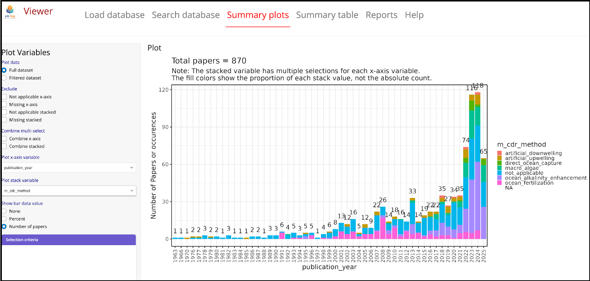

# Summary

To facilitate the review, evaluation and analysis of scientific literature, the lit-tag Shiny application provides a convenient interface for users to generate a citation database with custom, user-defined tags and notes. Lit-tag is not subject-specific and is useful for any field of research. Starting with a table of citations exported from a Zotero library and a user-generated Excel file describing a set of tags and notes fields, lit-tag provides tools for assigning tags and notes to papers (“lit-tag-builder” module) and for exporting, graphing, and generating reports from the resulting database (“lit-tag-viewer” module). The application has been used in several scientific reviews related to marine carbon dioxide removal @grabb.; @mcelhany; @gurney-smith.

# Statement of need

Scientific literature review and meta-analysis projects often involve summarizing the contents of many, often hundreds, of papers @snyder2019. During the review, data are collected on many different attributes of the study (e.g., experiment type, treatment conditions, location, results, etc.). Although literature review projects may start out collecting this information in a spreadsheet, the approach quickly becomes unwieldy as the number of papers and attributes increases. At the same time researchers are compiling data on the contents of papers, they need to conveniently collect and use the full citation information for each paper. The lit-tag app links the contents of a library generated with Zotero @digitalscholar2025a, an open-source reference management software which has tools for easily downloading citation information and adding references to documents, with a database of user-defined paper attributes and notes.

# Design

The lit-tag app has two modules: 1) lit-tag-builder for generating, editing and updating the database and 2) lit-tag-viewer for generating tables, graphs and reports from the database \autoref{fig:overview}.

The main editing tab in the builder module contains panels for selecting papers, viewing paper details and notes, and assigning tags to papers \autoref{fig:builder}. Other tabs in the builder module have tools for syncing with the Zotero database when adding new papers, database maintenance for global edits of the database (e.g., renaming a tag option, deleting categories), creating and linking to a new Zotero database and viewing the module user guide.

The viewer module contains options for searching and filtering the database (including custom searches using R syntax), plotting summary tables using any two tag variables for full and filtered datasets (Fig. 3), and generating custom tables (csv files) and reports (html, pdf or word). 

# Acknowledgements

Madison Wood’s work on this project was supported by a Sea Grant Knauss Fellowship. Kalina Grabb’s work on this project was supported by funding from NOAA Ocean Acidification Program and NOAA Northeast Fisheries Science Center through IBSS. We would also like to thank the International Council for the Exploration of the Sea (ICES) mCDR x Fisheries Workshop group for inspiration and app testing.

# References
